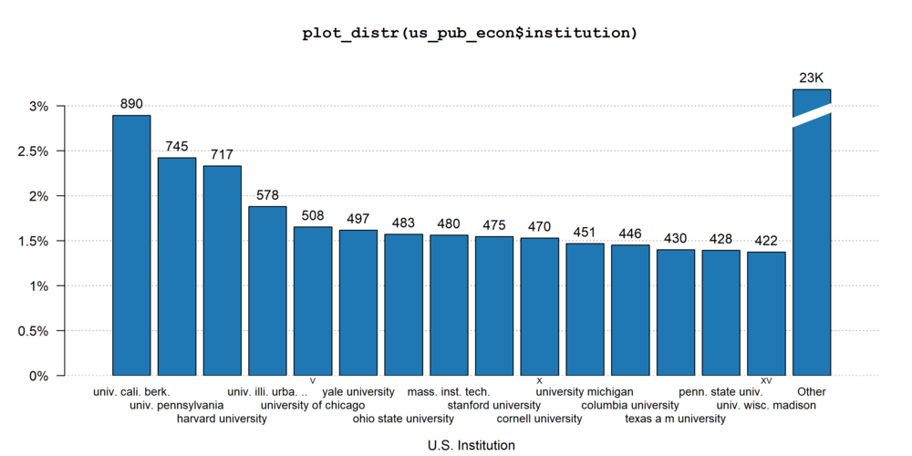
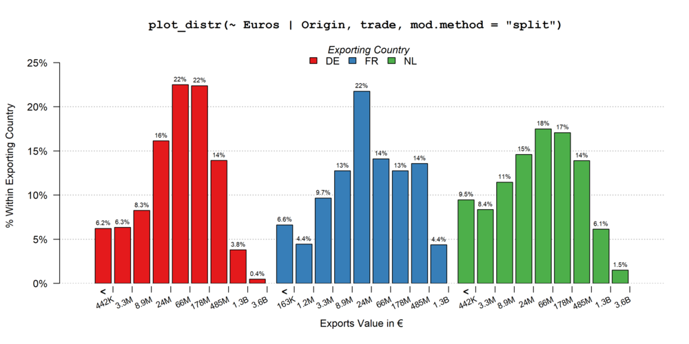

<a href="https://cran.r-project.org/web/checks/check_results_fplot.html"></a>
<a href="https://cran.r-project.org/package=fplot"> </a>
<a href="https://ipub.com/dev-corner/apps/r-package-downloads/">  </a>

`fplot` is an `R` package made for the easy plotting of distributions. 

The problem when it comes to distributions is that we often face a variety of data, each requiring a different type of layout: we don't represent the distribution of categorical variables similarly to continuous variables, and regarding the latter heavily skewed data may require a special treatment. The aim of `fplot` is to automatically make choices for the user in order to always display meaningful (and hopefully beautiful!) graphs. 

This brief description shows a gallery of `fplot` possibilities. For a more detailed introduction, please see the [walk-through](https://cran.r-project.org/package=fplot/vignettes/fplot_walkthrough.html).

The data sets used are `us_pub_econ` (from `fplot`) relating to publications in economics from US institutions, `trade` (from package `fixest`) relating to trade value between countries for some products in the European Union, and the `iris` data set (from base `R`).

One aim of `fplot`is to easily export graphs, it therefore includes a tool to relabel the variable names *globally* (once and for all). The following line is run before plotting the graphs:

```
setFplot_dict(c(Origin = "Exporting Country", Destination = "Importing Country", Euros = "Exports Value in €", 
                jnl_top_25p = "Pub. in Top 25% journal", jnl_top_5p = "Publications in Top 5% journal", 
                journal = "Journal", institution = "U.S. Institution", Petal.Length = "Petal Length"))
```


The code to run the plots are in the titles of the graphs. You'll notice that the same command line can result in a set of different graphs. 







